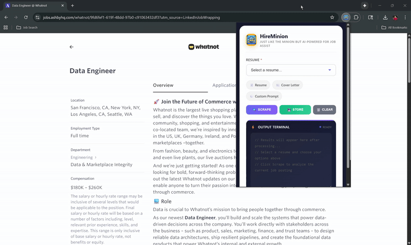
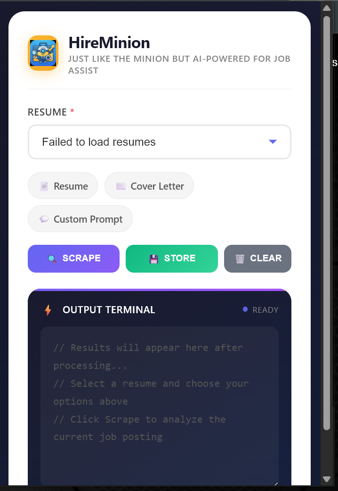

# 🤖 HireMinion

### *Your AI-Powered Job Application Sidekick*

<p align="center">
  
</p>

<p align="center">
  <b>Stop spending hours customizing resumes. Let HireMinion do the heavy lifting.</b>
</p>

---

## 🎬 See It In Action

<p align="center">
  
</p>

<p align="center">
  
</p>

---

## ✨ What is HireMinion?

Ever felt exhausted tailoring your resume for every single job application? **HireMinion** is your personal job application assistant that lives right in your browser.

Simply browse to any job posting, click a button, and watch the magic happen:

| 🎯 **You Do** | 🤖 **HireMinion Does** |
|--------------|----------------------|
| Find a job you like | Read & understand the job requirements |
| Click one button | Customize your resume to match the job |
| Apply with confidence | Generate a matching cover letter |
| | Track all your applications |

---

## 🚀 Features

### 📄 Smart Resume Tailoring
Your resume automatically highlights the skills and experience that matter most for each job. No more manual editing!

### ✉️ Cover Letter Generation
Get a professionally written cover letter that speaks directly to the job requirements — in seconds.

### 💾 Application Tracking
Never lose track of where you applied. HireMinion saves every job with one click.

### 🎨 Beautiful PDF Output
Professional LaTeX-compiled PDFs that look polished and ATS-friendly.

### 💬 Custom AI Prompts
Need something specific? Ask HireMinion anything about the job posting.

---

## 🎬 How It Works

```
┌────────────────────────────────────────────────────────────┐
│                                                            │
│   1️⃣  Browse to any job posting                            │
│                    ⬇️                                       │
│   2️⃣  Click the HireMinion extension                       │
│                    ⬇️                                       │
│   3️⃣  Select your resume & preferences                     │
│                    ⬇️                                       │
│   4️⃣  Hit "Scrape" and wait a few seconds                  │
│                    ⬇️                                       │
│   5️⃣  Download your tailored resume & cover letter! 📥     │
│                                                            │
└────────────────────────────────────────────────────────────┘
```

---

## 🌐 Works Everywhere

HireMinion works on virtually any job posting site:

<p align="center">
  <b>LinkedIn</b> • <b>Indeed</b> • <b>Greenhouse</b> • <b>Lever</b> • <b>Workday</b> • <b>SmartRecruiters</b> • <b>Company Career Pages</b>
</p>

---

# 🛠️ Setup Guide

## What You'll Need

| Requirement | How to Get It |
|-------------|---------------|
| 💻 A computer | Windows, Mac, or Linux |
| 🌐 Google Chrome | [Download here](https://www.google.com/chrome/) |
| 🐍 Python | [Download here](https://www.python.org/downloads/) (version 3.10 or newer) |
| 🔑 Gemini API Key | Free from Google (instructions below) |
| 📄 Your Resume | As a PDF file |

---

# 🔧 One-Time Setup

*Do these steps only once to get HireMinion ready!*

---

## Step 1: Download HireMinion

**Option A: Download ZIP**
1. Go to [**HireMinion on GitHub**](https://github.com/moheesh/HireMinion_AI_Job_Application_Assist)
2. Click the green **"Code"** button
3. Select **"Download ZIP"**
4. Extract the ZIP file to a folder (e.g., `Documents/HireMinion`)

**Option B: Using Git** (if you have it installed)
```
git clone https://github.com/moheesh/HireMinion_AI_Job_Application_Assist.git
```

---

## Step 2: Create & Activate Virtual Environment

1. **Open Terminal** (Mac/Linux) or **Command Prompt** (Windows)
   - Mac: Press `Cmd + Space`, type "Terminal", press Enter
   - Windows: Press `Win + R`, type "cmd", press Enter

2. **Navigate to the HireMinion folder:**
   ```
   cd path/to/HireMinion_AI_Job_Application_Assist
   ```

3. **Create a virtual environment:**
   ```
   python -m venv .venv
   ```

4. **Activate the virtual environment:**

   **On Mac/Linux:**
   ```
   source .venv/bin/activate
   ```
   
   **On Windows:**
   ```
   .venv\Scripts\activate
   ```
   
   > ✅ You'll see `(.venv)` appear at the start of your terminal line

---

## Step 3: Install Requirements

With your virtual environment activated, run:
```
pip install -r requirements.txt
```

Wait for all packages to install — this may take a minute or two.

---

## Step 4: Get Your Free Gemini API Key

HireMinion uses Google's Gemini AI to understand job postings and tailor your resume.

1. Go to **[Google AI Studio](https://aistudio.google.com/)**
2. Sign in with your Google account
3. Click **"Get API Key"** in the left sidebar
4. Click **"Create API Key"**
5. Copy the key (it looks like `AIzaSy...`)

> 💡 **Tip:** The free tier gives you plenty of usage for job applications!

---

## Step 5: Configure Your API Key

1. In the HireMinion folder, find the file named **`.env.sample`**
2. **Rename it** to **`.env`**
3. Open `.env` in any text editor (Notepad, TextEdit, VS Code, etc.)
4. Paste your Gemini API key:
   ```
   GEMINI_API_KEY=AIzaSy_your_actual_key_here
   ```
5. Save the file

> ⚠️ **Important:** Never share your API key with anyone!

---

## Step 6: Set Up Your Resume

You have **two options** to add your resume:

### Option A: Auto-Extract from Your PDF (Recommended) 🤖

*Let AI extract your resume data automatically!*

1. **Copy your resume PDF** to the `data/` folder
2. **Run the extractor:**
   ```
   python backend/resume_extractor.py --resume YourResume.pdf
   ```
   Replace `YourResume.pdf` with your actual filename.

3. **Wait for completion** — you'll see "EXTRACTION COMPLETE"
4. **Double-check your data:**
   - Open `templates/YourResume.json`
   - Review all fields (name, experience, skills, etc.)
   - Fix any errors the AI might have made

> ✅ This creates both `.json` (your data) and `.tex` (the template) files

---

### Option B: Use Pre-Built Template (Manual) ✍️

*Use our sample format and fill in your details!*

1. Go to the `samples/` folder
2. **Copy these files** to the `templates/` folder:
   - `resume.json` → rename to `YourName_Resume.json`
   - `resume.tex` → rename to `YourName_Resume.tex`
3. **Also copy the `.tex` file** to the `data/` folder (same name)
4. **Edit the `.json` file** with your actual information:
   - Open in any text editor
   - Replace all sample data with your details
   - Save the file

---

## Step 7: Install the Chrome Extension

1. Open **Google Chrome**
2. Type `chrome://extensions` in the address bar and press Enter
3. Turn on **"Developer mode"** (toggle in the top-right corner)
4. Click **"Load unpacked"**
5. Navigate to the HireMinion folder and select the **`extension`** folder
6. You'll see HireMinion appear in your extensions! 🎉

> 💡 **Tip:** Click the puzzle icon 🧩 in Chrome and pin HireMinion for easy access

---

# 🚀 Every Time You Use HireMinion

*Do this each time you want to use HireMinion!*

---

## Start the Backend Server

1. **Open Terminal/Command Prompt**

2. **Navigate to HireMinion folder:**
   ```
   cd path/to/HireMinion_AI_Job_Application_Assist
   ```

3. **Activate virtual environment:**
   
   **Mac/Linux:**
   ```
   source .venv/bin/activate
   ```
   
   **Windows:**
   ```
   .venv\Scripts\activate
   ```

4. **Start the server:**
   ```
   python backend/main.py
   ```

5. You should see: **`🚀 Backend running on port 8000`**

> 📌 **Keep this terminal window open** while using HireMinion!

---

## 🎮 Using HireMinion

### Tailoring a Resume

1. **Go to any job posting** (LinkedIn, Indeed, company website, etc.)
2. **Click the HireMinion icon** in your browser
3. **Select your resume** from the dropdown
4. **Check what you want:**
   - ☑️ **Resume** — Tailored resume PDF
   - ☑️ **Cover Letter** — Matching cover letter
   - ☑️ **Custom Prompt** — Ask anything about the job
5. **Click "Scrape"** and wait 10-30 seconds
6. **Find your files** in the `output` folder!

### Tracking Applications

After you apply to a job:
1. Stay on the job posting page
2. Click **"Store"** in HireMinion
3. The job is saved to your application tracker ✅

### Clearing Data

Click **"Clear"** to reset and start fresh.

---

## 📁 Where to Find Your Files

| What | Where |
|------|-------|
| 📄 Generated PDFs | `output/` folder |
| 📋 Job Archive | `resume_archive/` folder |
| 📝 Your Templates | `templates/` folder |

---

## ❓ Troubleshooting

### "Connection failed" error
✅ Make sure the backend is running (Step 6)
✅ Check that you see "Backend running on port 8000"

### "No resumes found"
✅ Make sure your `.tex` file is in the `data/` folder
✅ Restart the backend server

### Extension not working
✅ Refresh the job posting page
✅ Make sure Developer mode is ON in Chrome extensions

### Resume doesn't look right
✅ Try running the resume extractor again
✅ Check the `templates/` folder for your `.json` file and edit if needed

---

## 💡 Pro Tips

1. **Keep the backend running** in a terminal window while job hunting
2. **Pin the extension** for quick access
3. **Use Custom Prompt** to ask questions like:
   - "What skills should I emphasize?"
   - "Summarize the key requirements"
   - "What's the salary range?"
4. **Check your tailored resume** before sending — AI is helpful but not perfect!

---

## 🆘 Need Help?

- 📖 Check the [Troubleshooting](#-troubleshooting) section above
- 🐛 Found a bug? [Open an issue](https://github.com/moheesh/HireMinion_AI_Job_Application_Assist/issues)
- 💬 Have questions? [Start a discussion](https://github.com/moheesh/HireMinion_AI_Job_Application_Assist/discussions)

---

## 📜 License

MIT License — Free to use and modify!

---

<p align="center">
  <b>Made with ❤️ for job seekers everywhere</b>
</p>

<p align="center">
  <i>Stop tailoring resumes manually. Start landing interviews.</i>
</p>

<p align="center">
  ⭐ Star this repo if HireMinion helped you! ⭐
</p>
